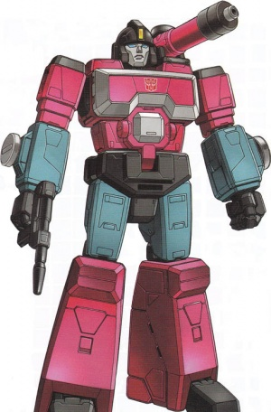

# SOON\_ FM | Perceptor

Perceptor is the new SFM\_ events system for websocket communication between the Player and API.
This allows the player to connect to the events system without the need for a direct connection
to Redis, meaning the player no longer needs to connect to the VPN to get events.
