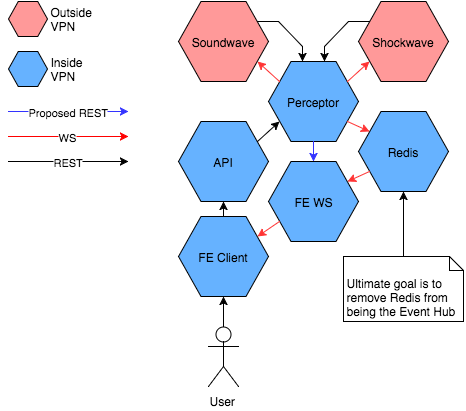

# SOON\_ FM | Perceptor


Perceptor is the new SFM\_ events system for websocket communication between the Player and API.
This allows the player to connect to the events system without the need for a direct connection
to Redis, meaning the player no longer needs to connect to the VPN to get events.

The ultilate goal will be to remove Redis as the main events hub, moving to REST pushes to various
evented services on demand.

<div align="center">
    
</div>

## Development

This package uses [Glide](https://github.com/Masterminds/glide) for vendoring, please follow the
install instructions on the [Glide](https://github.com/Masterminds/glide) repository. Ensure you
have `Go 1.5` and `Glide 0.5.0` installed.

### Create a Workspace

Firsrt create a workspace, this will form part of your `$GOPATH`.

```
mkdir -p ~/Development/Perceptor/src/github.com/thisissoon/FM-Perceptor
```

Now set your `$GOPATH`:

```
export GOPATH=~/Development/Perceptor
export GO15VENDOREXPERIMENT=1
```

We have also set `GO15VENDOREXPERIMENT=1` to make use of the `/vendor` dirctory support in `Go 1.5`.

### Clone the Project

Now you can clone the project into the workspace.

```
cd ~/Development/Perceptor/src/github.com/thisissoon/FM-Perceptor
git clone git@github.com:thisissoon/FM-Perceptor.git .
```

### Get Dependencies

Now we can get the dependencies using `glide`.

```
glide up
```

### Build

Now the project can be built:

```
go build $(glide nv)
```
